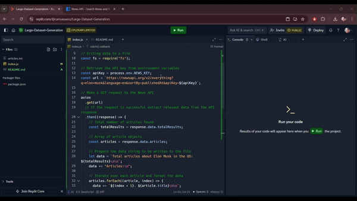

# Large Dataset Generation
This repository contains scripts and instructions for generating a large dataset from a News API using Node.js. This guide will walk you through the process, from setting up your environment to running the scripts and exporting the data.

## Table of Contents

- [Introduction](#introduction)
- [API Details](#api-details)
- [Script Explanation](#script-explanation)
  - [Fetching Data](#fetching-data)
  - [Writing Data to File](#writing-data-to-file)
- [Running the Script](#running-the-script)
- [Example Output](#example-output)
- [Prerequisites](#prerequisites)
- [Setup](#setup)
  - [Cloning the Repository](#cloning-the-repository)
  - [Installing Dependencies](#installing-dependencies)
  - [Environment Variables](#environment-variables)
- [Technologies](#technologies)
- [Project Structure](#project-structure)
- [Author](#author)
- [Contact](#contact)

## Introduction

This project demonstrates how to generate a large dataset by fetching data from an API and exporting it to a text file. I uses the News API to gather articles about a specific topic and store the results in a `.txt` file.

## API Details
Used the [News API](https://newsapi.org/) to fetch the latest news articles. Here are the details:
- Endpoint:
  `https://newsapi.org/v2/everything`
- Parameters:
  - `q`: The query keyword (e.g., Elon Musk)
  - `language`: The language of the articles (e.g., en for English)
  - `sortBy`: The sorting criteria (e.g., publishedAt for the most recent articles)
  - `apiKey`: Your News API key

## Script Explanation
### **Fetching Data**
The script uses the axios library to fetch data from the News API. Here's a breakdown of the fetching process:

````
// Import modules

// For making HTTP requests to the API
const axios = require("axios");

// Load environment variables from .env file
require("dotenv").config();

// Eriting data to a file
const fs = require("fs");

// Retrieve the API key from environment variables
const apiKey = process.env.NEWS_KEY;
const url = `https://newsapi.org/v2/everything?q=elon+musk&language=en&sortBy=publishedAt&apiKey=${apiKey}`;

// Make a GET request to the News API
axios
  .get(url)
  // If the request is successful extract relevant data from the API response
  .then((response) => {
    // Total number of articles found
    const totalResults = response.data.totalResults;

    // Array of article objects
    const articles = response.data.articles;

    // Prepare the data string to be written to the file
    let data = `Total articles about Elon Musk in the US: ${totalResults}\n\n`;
    data += "Articles:\n";

    // Iterate over each article and format the data
    articles.forEach((article, index) => {
      data += `${index + 1}. ${article.title}\n\n`;
      data += `Source: , ${article.source.name}\n\n`;
      data += `Published at: ${article.publishedAt}\n\n`;
      data += `URL: ${article.url}\n\n`;
    });

    // Write the formatted data to a file named 'articles.txt'
    fs.writeFile("articles.txt", data, (err) => {
      if (err) {
        // Log an error message if writing fails
        console.error("Error writing to file:", err);
      } else {
        // Log success message
        console.log("Data successfully written to articles.txt");
      }
    });
  })
  // If there's an error during the API request
  .catch((error) => {
    // Log the error
    console.error("Error fetching the articles:", error);
  });

````
### **Writing Data to File**
The fetched data is formatted and written to a .txt file using the fs (File System) module:
```
fs.writeFile('articles.txt', data, (err) => {
  if (err) {
    console.error('Error writing to file:', err);
  } else {
    console.log('Data successfully written to articles.txt');
  }
});
```

## Running the Script
To run the script and generate your dataset, use the following command:
``node index.js
``
This will fetch the latest articles about Elon Musk, format the data, and write it to `articles.txt`

## Example Output
After running the script, you will find `articles.txt` in the root directory with content similar to:

```
Total articles about Elon Musk in the US: 100

Articles:
1. Elon Musk's SpaceX launches new rocket
   Source: TechCrunch
   Published At: 2024-08-06T12:34:56Z
   URL: https://techcrunch.com/article

2. Tesla's new model breaks records
   Source: The Verge
   Published At: 2024-08-06T11:23:45Z
   URL: https://theverge.com/article

...

```
## Prerequisites
Before you begin, ensure you have the following installed:
  - [Node.js](https://nodejs.org/) installed.
  - News API Key (You can get one from [News API](https://newsapi.org/)

## Setup

### **Cloning the Repository**
1. First, clone this repository to your local machine:
`` git clone https://github.com/yourusername/large-dataset-generation.git ``
`` cd large-dataset-generation ``
### **Installing Dependencies**
2. Install the required Node.js packages:
### **Environment Variables**
3. Create a `.env` file in the root directory of the project and add your News API key:
   - `npm i dotenv`
   - Add the following line to the `.env` file:
     `NEWS_API_KEY=your_news_api_key_here`
     
## Technologies
This project uses the following technologies:
- **Replit:** For online coding and development
- **Node.js:** JavaScript runtime environment
- **JavaScript:** Programming language used for the script
- **axios:** Promise-based HTTP client for making API requests

## Project Structure
```
large-dataset-generation
├── index.js          
├── README.md         
├── articles.txt      
├── .env              
└── video              process
    └── creating_data.gif
            

```

## Author
**Carisa Saenz-Videtto**

## Contact
carisasaenz@gmail.com
